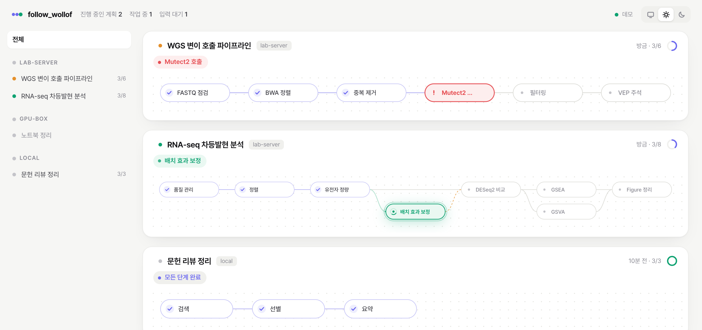

# follow_wollof

[한국어](README.ko.md)

A small dashboard for keeping an eye on Claude Code sessions spread across several machines.

I usually have a few long analyses running at once, on my laptop and on a couple of servers. Each Claude Code session starts by laying out a plan and then works through it, and after switching to something else for a while I lose track of which session is where. follow_wollof draws each session's plan as a graph and marks the step it is on, updating live. When a plan changes halfway, the new step shows up branching off the step it came from and joining the step it feeds into, so you can still tell how the plan got to where it is.



*Sample data. The UI is in Korean.*

## How it works

Each session records its plan with a small CLI, `follow.py`. Every call appends a line to `~/.follow_wollof/sessions/<session-id>/events.jsonl`, so nothing is overwritten and the history of the plan stays around. A block in the global `CLAUDE.md` asks Claude to do this for multi-step work, and a Stop hook nudges it once if a turn ends without an update.

The dashboard server keeps one SSH connection per host and sends a small watcher script over it, so a server needs nothing installed just to be watched. The watcher reads Claude Code's own session files in `~/.claude/sessions` along with the plan logs, and reports changes every couple of seconds.

It is plain Python with no third-party packages.

## Requirements

- Python 3.8+ on the computer that shows the dashboard (macOS, Linux or Windows), Python 3.6+ on servers
- Claude Code on every host you want to follow
- SSH key login to remote hosts: `ssh <host> true` should finish without asking anything

## Setup

```bash
git clone https://github.com/Sejung98/follow_wollof.git
cd follow_wollof
./fw init        # creates config.ini
```

On Windows, run `fw.cmd` wherever this page says `./fw`.

List your hosts in `config.ini`. Everything else has a default.

```ini
[host:local]
type = local

[host:lab-server]
type = ssh
ssh = lab-server   ; Host alias from ~/.ssh/config, or user@hostname
```

Then:

```bash
./fw check     # can every host be reached?
./fw deploy    # install the session tools on each host
./fw           # start the server and open http://localhost:7777
```

`deploy` puts `follow.py` and the Stop hook in `~/.follow_wollof/bin`, adds a `/follow` skill, one marked block to `~/.claude/CLAUDE.md` and one Stop hook entry to `~/.claude/settings.json`. Both files are backed up the first time. `./fw deploy --uninstall` takes it all out again.

`./fw autostart on` starts the server at login (launchd, a systemd user service, or the Windows Startup folder).

## Usage

New sessions start recording on their own once they take on something with several steps. In a session that was already open, type `/follow`.

You can also call the CLI yourself (`python` instead of `python3` on Windows):

```bash
F=~/.follow_wollof/bin/follow.py
python3 $F plan "RNA-seq DE analysis" qc:QC align:Alignment count:Counts deg:DESeq2 gsva:GSVA
python3 $F next qc           # start the first step
python3 $F next align        # qc is done, align starts
python3 $F derive batch "Batch correction" --from count --into deg --reason "batch effect in PCA"
python3 $F drop gsva --reason "not needed"
python3 $F block deg "waiting for the sample sheet"
python3 $F topic ncc-rnaseq "bulk DE"   # link sessions that work on the same subject
python3 $F topics                       # topic names already used on this host
python3 $F out deg report/DEG.pdf fig/volcano.png   # files a step produced; open them from the dashboard
python3 $F show
```

The dashboard opens on the ontology view: every session on every host in one graph, coloured by host, with sessions that share a topic linked through it (and a dashed link between sessions whose plan titles overlap). Sessions that ended in the last 7 days stay on it, dimmed. Click a node to inspect it; `Open progress page` (or double-click) goes to that session's page at `/?s=<host>/<session-id>`.

In the sessions view, click a panel to open it with its plan history, and drag a panel by its title row to reorder. `http://localhost:7777/?demo` shows the dashboard with sample data.

`./fw selftest` runs every part against a throwaway home folder, without touching your own setup. Worth running once on a new machine.

The server only listens on 127.0.0.1.
